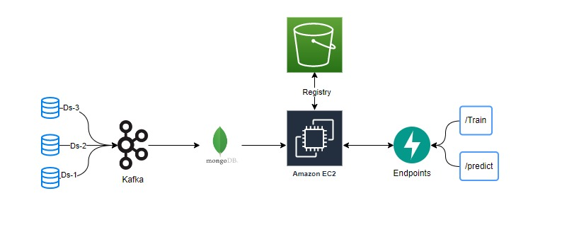

# Sensor-Fault-Detection
### Problem Statement

The Air Pressure System (APS) is a critical component of a heavy-duty vehicle that uses compressed air to force a piston to provide pressure to the brake pads, slowing the vehicle down. The benefits of using an APS instead of a hydraulic system are the easy availability and long-term sustainability of natural air.

This is a Binary Classification problem, in which the affirmative class indicates that the failure was caused by a certain component of the APS, while the negative class indicates that the failure was caused by something else.

### Solution Proposed
In this project, the system in focus is the Air Pressure system (APS) which generates pressurized air that are utilized in various functions in a truck, such as braking and gear changes. The datasets positive class corresponds to component failures for a specific component of the APS system. The negative class corresponds to trucks with failures for components not related to the APS system.

The problem is to reduce the cost due to unnecessary repairs. So it is required to minimize the false predictions.

## Tech stack used
1. Python
2. FastAPI
3. Machine learning algorithms
4. Docker
5. MongoDB

## Infrastructure Required
1. AWS S3
2. AWS EC2
3. AWS ECR
4. Github Actions

### Prerequisites

Before we run the project, make sure that you are having MongoDB in your local system or on cloud, with Compass since we are using MongoDB for data storage. You also need AWS account to access the service like S3, ECR and EC2 instances. 

## High level architecture

### Data collection



### Project Architecture


### Deployment Architecture


### Step 1: Clone the repository
```bash
git clone https://github.com/kumarrohit26/sensor-fault-detection.git
```

### Step 2- Create a conda environment after opening the repository

```bash
conda create -p venv python=3.8 -y
```

```bash
conda activate venv/
```

### Step 3 - Install the requirements
```bash
pip install -r requirements.txt
```

### Step 4 - Export the below environment variable

1. AWS_ACCESS_KEY_ID
2. AWS_SECRET_ACCESS_KEY
3. AWS_DEFAULT_REGION
4. MONGODB_URL


### Step 5 - Run the application server
```bash
python main.py
```

### Step 6. Train application
```bash
http://localhost:8080/train

```
